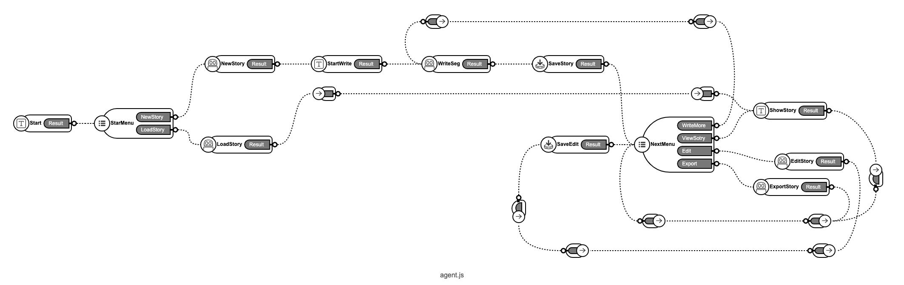
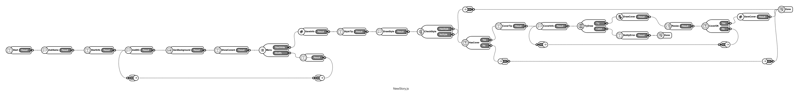
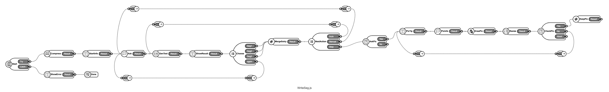
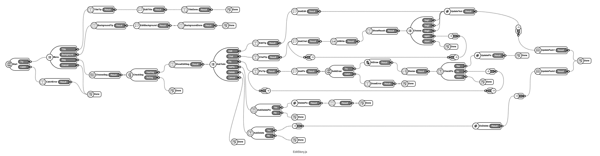
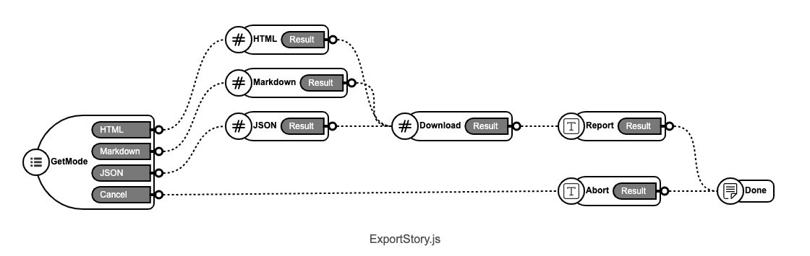

# StoryWriter
这是一个 撰写短篇文章/小说的 Agent，受到了MidReal等项目的启发。

## 系统特点

- 该项目生成的是网页 PWA App，可以在浏览器中直接运行
- 支持桌面（宽屏）和移动（窄屏）
- 可以切换 AI 模型，现在可以在 ChatGPT 3.5 和 ChatGPT 4 之间切换
- 创建项目的时候指定绘画风格，在编写的时候可以绘制封面和插画
- 精确的无限长文编写，虽然主要目的是编写短篇的文章，但是通过文章背景设定和内容提炼辅助，可以撰写无限长的文章。
- 强大的编辑文章能力，支持逐段落的修改，包括内容和插图，修改的时候可以选择是否由 AI 辅助完成
- 输出HTML格式或者Markdown格式的文章

## 快速开始
有几种方式部署这个工程
1. 在[www.ai2apps.com](www.ai2apps.com)里，使用项目向导创建 AI Agent，选择 StoryWriter 模版即可
2. 在本地部署的AI2Apps环境中，使用项目向导，创建 AI Agent，选择 StoryWriter 模版即可
3. 在[www.ai2apps.com](www.ai2apps.com)或者本地部署的AI2Apps环境里，创建一个目录，把本工程的内容同步到目录中，在用IDE打开。

## 主要Agent（智能体）说明

### agent.js：主智能体

  

Agent App 的主逻辑智能。

### NewStory.js: 创建新的文章

  

- 询问用户文章标题
- 根据用户提示由AI生成文章的背景设定
- 设置文章插图绘制风格
- 可选：绘制文章封面

### WriteSeg.js: 撰写一段文章

- 根据用户指示撰写一段文章
- 每次生成三个备选供用户选择
- 可选：自动无题事续写
- 可选：增加插图

### EditStory.js: 编辑文章

- 更改标题
- 修改文章背景设定
- 选择段落，修改段落内容
- 手动修改段落内容
- AI 辅助修改段落内容
- 删除段落
- 添加/更换段落插图
- 删除段落插图

### ExportStory.js: 输出文章

- 输出为HTML文件
- 输出为Markdown文件
- 输出JSON工程文件

